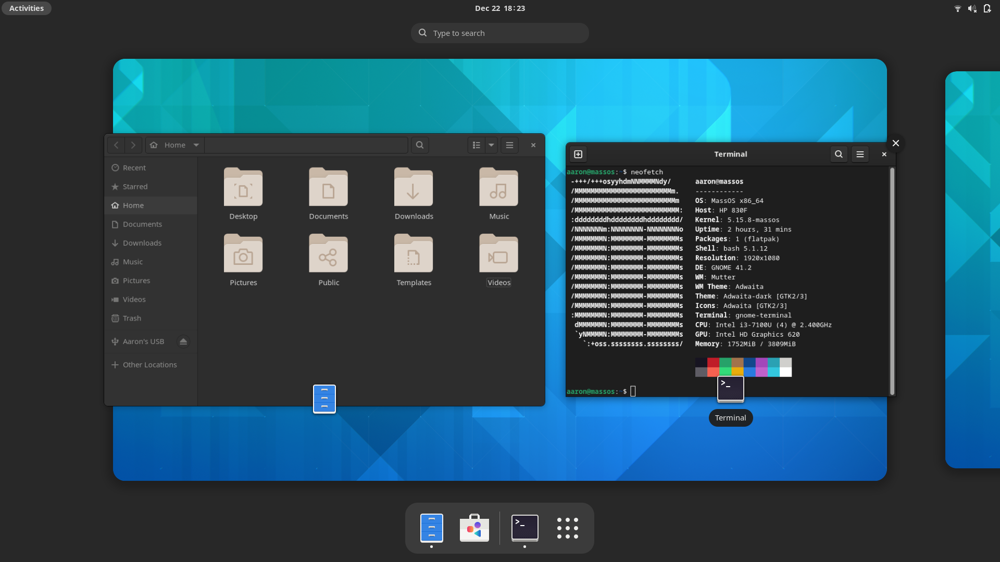
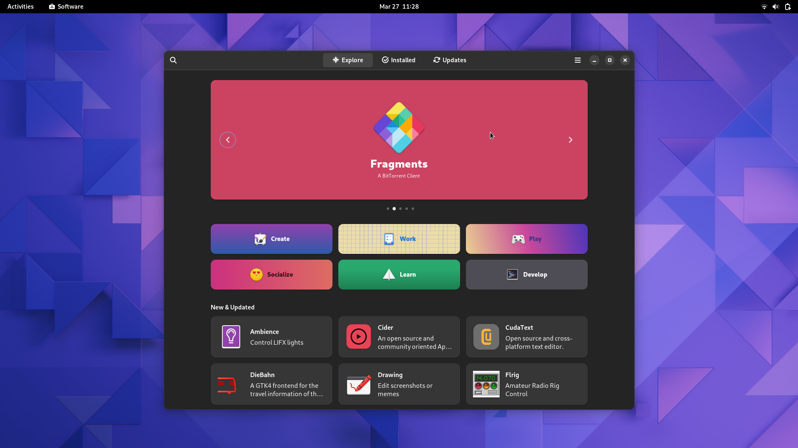

# Welcome To MassOS
Welcome to **MassOS**, a [free](https://github.com/MassOS-Linux/MassOS/wiki/MassOS-and-Free-Software) GNU/Linux operating system for x86_64 devices, which aims to be minimal and lightweight, without compromising features. It uses the [Xfce](https://xfce.org) desktop environment.

The MassOS system itself is under 5 gigabytes. Quite impressive for a GNU/Linux distribution containing a full desktop environment and common programs, as well as development tools/headers. Some distributions are able to achieve minimalism by using smaller replacements for common GNU software, at the cost of some features. With MassOS, you get the minimal size, without compromising the advanced features exclusive to GNU software.
# Not Based On Any Other Distro
MassOS is completely independent and built entirely from the ground up; it is not based on any other distribution. Due to not being dependent on another distribution, it is able to boast the latest and greatest in software versions.

The MassOS base system itself already contains a large selection of software which should suit most users. Instead of using a "classic" package manager (although [one is currently in development](https://github.com/TheSonicMaster/masspkg)), the universal **Flatpak** package manager (complemented by the GUI Gnome Software centre) can be used to install GUI-based software. AppImages are also supported. Additionally, developer-orientated users may also wish to compile software themselves, since the necessary tools and headers are provided with the system.

# Installing MassOS
MassOS has a live CD ISO which can be used to try out MassOS and easily install it.

Please see the [installation guide](installation-guide.md) for more information, and installation instructions.

The latest release can be found on the [releases page](https://github.com/TheSonicMaster/MassOS/releases).

Some developers may also wish to [build MassOS themselves](building.md) using the scripts in this repo. This is not recommended for most users.
# About This Repo
This repo contains the scripts which are used to build the complete MassOS system. Most people won't want to run these. Instead, you can download the latest release tarball of MassOS from the [releases page](https://github.com/TheSonicMaster/MassOS/releases).
# Releases
The latest release of MassOS can be downloaded from the [releases page](https://github.com/TheSonicMaster/MassOS/releases). From there you can also view the release notes and check out past releases too.

Release numbers follow the format **YYYY.MM**. For example: the August 2021 release was **2021.08**. On a working MassOS system, you can check the version by running `massos-release`. There is a new release of MassOS roughly once or twice per month. New releases will usually include updated software. A new release in the same month as an existing release will typically be less major, and will have a version in the format **YYYY.MM.2**. You can upgrade an existing MassOS installation by using the [MassOS Upgrade Utility](https://github.com/TheSonicMaster/massos-upgrade).

Developers who wish to test out some of the latest in-development features for the next version MassOS can take a look at the [development branch](https://github.com/TheSonicMaster/MassOS/tree/development).
# Joining The Community
Most discussion happens in The Sonic Master's [Discord Server](https://discord.gg/EfshNrt), in the `#tech-chat` channel. Click here to join it:

For general queries, you can alternatively send an email to [daniel@thesonicmaster.net](mailto:daniel@thesonicmaster.net).
# Bug Reporting
If you have found a bug in MassOS, please do the following before reporting it:

- Check that you are on the latest version of MassOS, by running `massos-release`.
- Check the [development branch](https://github.com/TheSonicMaster/MassOS/tree/development) to see if your issue has already been fixed for the next version of MassOS.

If you have checked both of these, and you believe this issue has not already been fixed in the development branch, then go to the [issues](https://github.com/TheSonicMaster/MassOS/issues) page and open an issue. Please describe your issue in detail, and provide any relevant logs and screenshots which could help us debug your issue.
# Contributing
You are welcome to fork the MassOS repository and make changes/additions as you wish. If you then want to contribute your changes back, you can do so by opening a [pull request](https://github.com/TheSonicMaster/MassOS/pulls). However, we ask that you follow these guidelines if you want to contribute your changes:

- Please only modify the **development** branch. If you've forked MassOS, you can switch the branch to **development** or set the main branch of your fork to the development branch, but either way, we will only accept changes to the development branch.
- Similarly, please only submit pull requests to the **development** branch. Pull requests will never be merged directly into the main branch.

If you make a significant contribution to MassOS, your name may be featured in the [Contributors List](contributors.md).
