# Installation Guide
This guide aims to guide you through the installation of MassOS.

**NOTE:** You can upgrade an existing installation of MassOS by using the [Release Upgrade Utility](https://github.com/TheSonicMaster/massos-upgrade).
# System Requirements
- At least 8GB of free disk space (16GB+ recommended).
- At least 1GB of RAM (2GB+ recommended).
- An empty flash drive of at least 2GB for the live environment and installer.
- Minimum 1024x768 screen resolution (some programs won't display properly below this and the UI will generally be hard to use and navigate). If you are using VirtualBox, we strongly recommend enabling EFI from VM Settings --> System, since it has a higher default screen resolution.

# Release Notes
This is the development version of MassOS. It contains the following changes since the previous version, **2022.02.2**, however may be subject to more changes before the next version is released:

- Added DJVU and XPS support to Evince.
- Added dvd+rw-tools.
- Only the client portion of Samba (smbclient) is now installed, to save some space.
- Added a workaround to fix the current of Firefox with FFmpeg 5.
- Added some extra multimedia codec libraries.
- Removed gsasl (unneeded package).

It also includes the following upgraded software, however there may be more before the next version is released:

- AccountsService: `22.04.62 --> 22.07.4`
- btrfs-progs: `5.16 --> 5.16.2`
- cups-filters: `1.28.11 --> 1.28.12`
- efivar: `37 --> 38`
- Expat: `2.4.3 --> 2.4.5`
- Firefox: `97.0 --> 97.0.1`
- iana-etc: `20220207 --> 20220218`
- libdrm: `2.4.109 --> 2.4.110`
- libinput: `1.19.3 --> 1.20.0`
- librsvg: `2.52.5 --> 2.52.6`
- libwnck: `40.0 --> 40.1`
- Nano: `6.1 --> 6.2`
- Qpdf: `10.6.0 --> 10.6.2`
- tree: `2.0.1 --> 2.0.2`
- Unifont: `13.0.06 --> 14.0.01`
- WebKitGTK: `2.34.5 --> 2.34.6`
- x264: `0.164.3081 --> 0.164.3086`
- x265: `3.5-19-g747a079f7 --> 3.5-35-g7a5709048`

# Installing MassOS Using The Live CD ISO
MassOS has a live CD ISO file which can be used to easily install MassOS.

If you'd rather install MassOS manually, see [old-installation-guide.md](old-installation-guide.md).

Head to the [Releases](https://github.com/MassOS-Linux/MassOS/releases) page to download the latest version. You'll want to download the standard ISO labelled "massos-\<VERSION\>-x86_64.iso". There also exists a "nofirmware" ISO, which is for people who don't want any non-free firmware for some hardware devices. If you have a device requiring non-free firmware (typically wireless, graphics and sound cards), or if you are unsure, get the regular ISO.

If you are a developer and want to test out the latest changes from development branch, you should [building.md](build MassOS yourself), or infrequent builds can be found on [this Google Drive folder](https://go.thesonicmaster.net/qk9).
# Writing the ISO to a USB flash drive.
## On Windows.
1. Download the Rufus tool [from here](https://rufus.ie).
2. Run the downloaded Rufus tool and ensure your USB drive is selected.
3. Change the "Boot selection" dropdown to "Disk or ISO image" and click "Select".
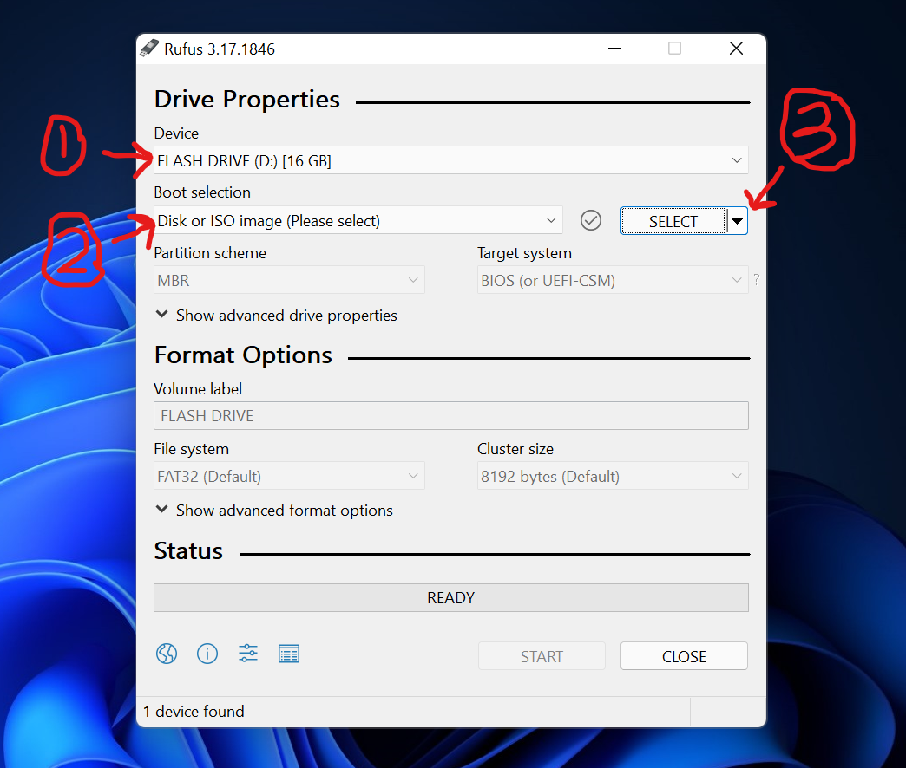
4. Browse and select your ISO file.
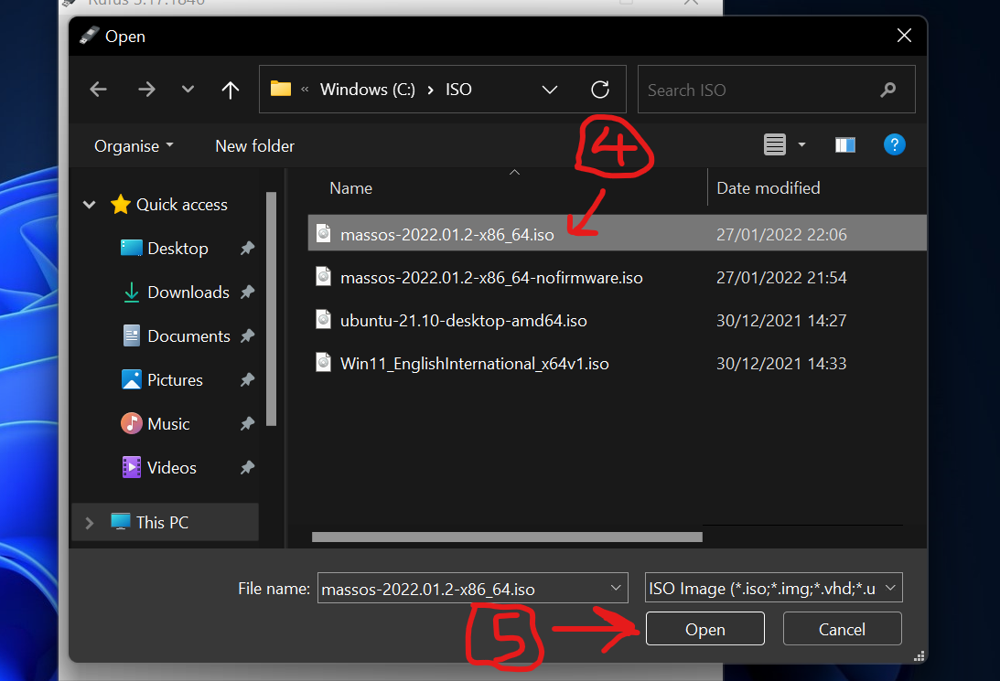
5. Ensure the "Partition scheme" is set to "MBR" and the "Target system" is set to "BIOS or UEFI". Then, leaving all other settings as the default, press "Start".
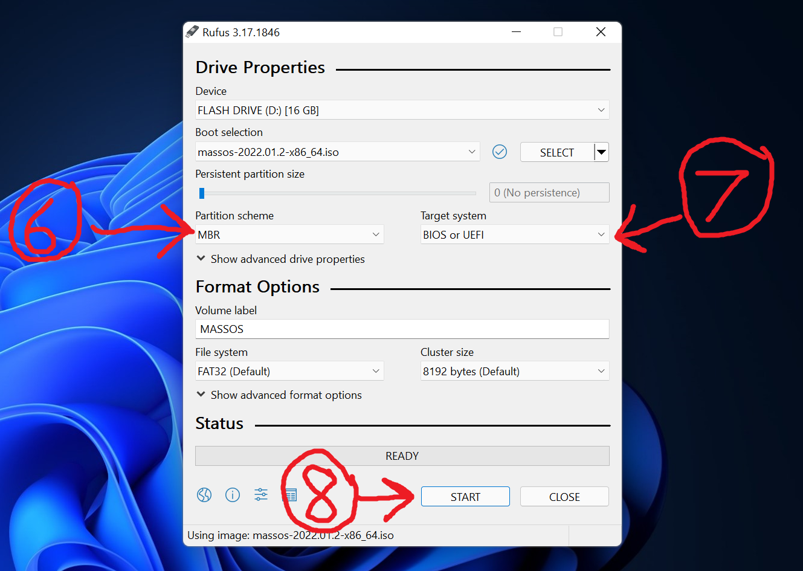
6. Now change the write mode to "Write in DD image mode" and press "OK".
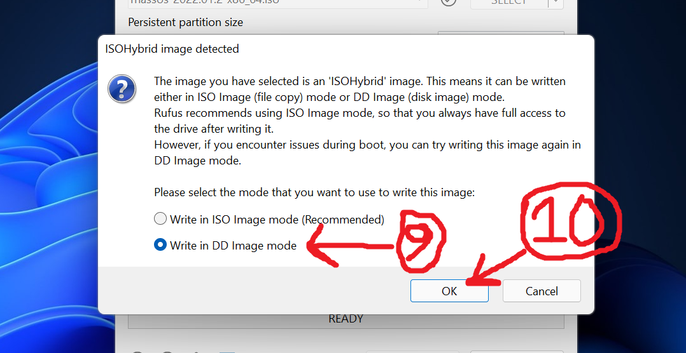
7. Press "OK" to confirm and start writing the image. As the message states, it will erase the disk, so make sure any important data on it has been moved elsewhere.
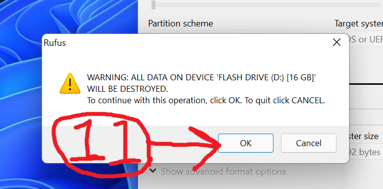
8. After the operation finishes, close Rufus. Your USB flash drive is now bootable and ready to go. See "Booting the live environment" below for what to do next.

## On GNU/Linux.
While there are graphical utilities for creating a bootable flash drive, they may differ between distributions and not be available on all distributions. Instead, we will use a universal terminal command.

1. Plug in your USB flash drive and open a terminal (usually Control+Alt+T).
2. Identify your USB flash drive by running the command `sudo fdisk -l`. It will display information about all disks on your system. Look for the name of the device. It should be in the format /dev/sdX, where X is a letter, e.g. /dev/sdb.
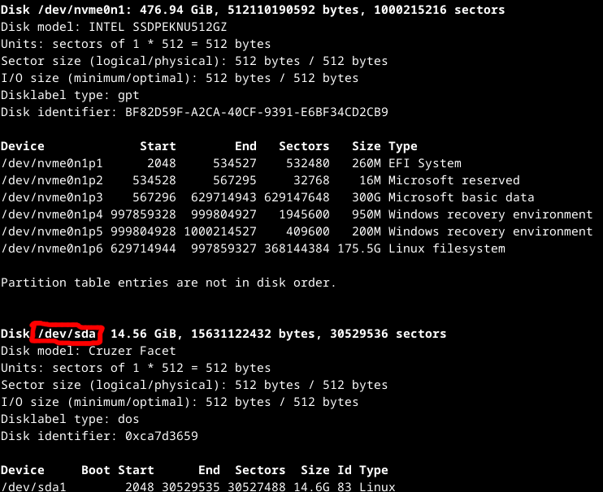
3. Run the following command, **ensuring you replace <filename>.iso with the actual ISO filename and /dev/sd<X> with your USB drive:
```
sudo dd if=<filename>.iso of=/dev/sd<X> status=progress
```
For example:
```
sudo dd if=massos-2022.02-x86_64.iso of=/dev/sdb status=progress
```
# Booting the live environment.
You'll need to restart your computer to be able to boot from your USB flash drive. To boot from the flash drive, you normally have to press a special key during startup (when you see the BIOS logo). This could be any of the following: Escape, F1, F2, F9, F10, F11, F12, Delete. If done successfully, MassOS will start up from your USB flash drive.

**NOTE:** If you are using UEFI and the boot fails, you may need to [disable secure boot](https://www.rodsbooks.com/efi-bootloaders/secureboot.html#disable) in your firmware settings.

After the live system has booted, you'll be shown a welcome screen like this:
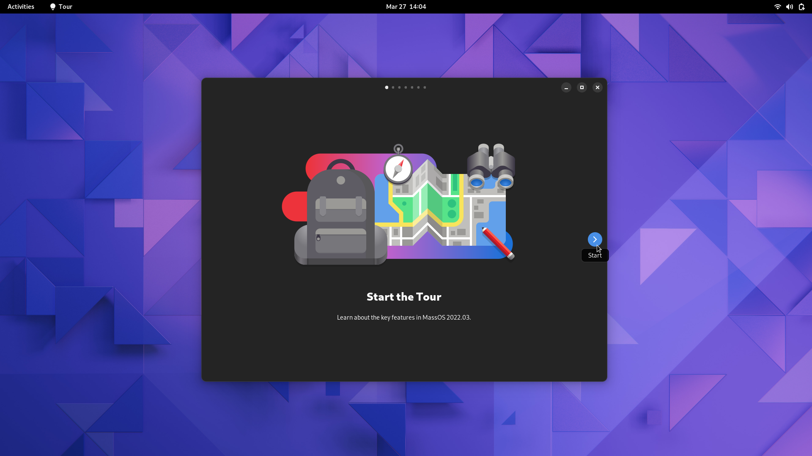
This shows some of the key features in MassOS and how to navigate the OS.

You can use this live system to try out MassOS before you decide to install it.
# Starting the installation.
1. Launch the installation program found on the desktop to begin the installation of MassOS.
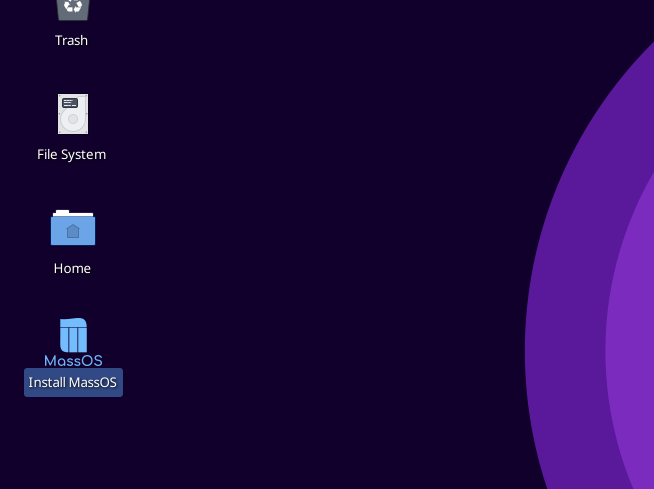
2. Choose "Install" to start the installation.
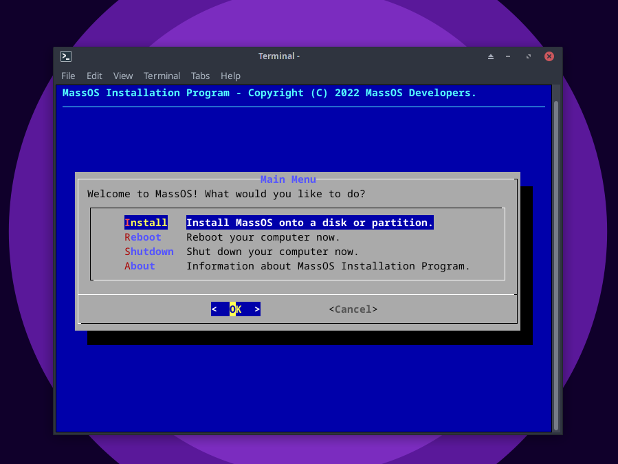
3. Choose which disk you want to use for the installation. It should differ from the USB flash drive you used to create the bootable live environment.
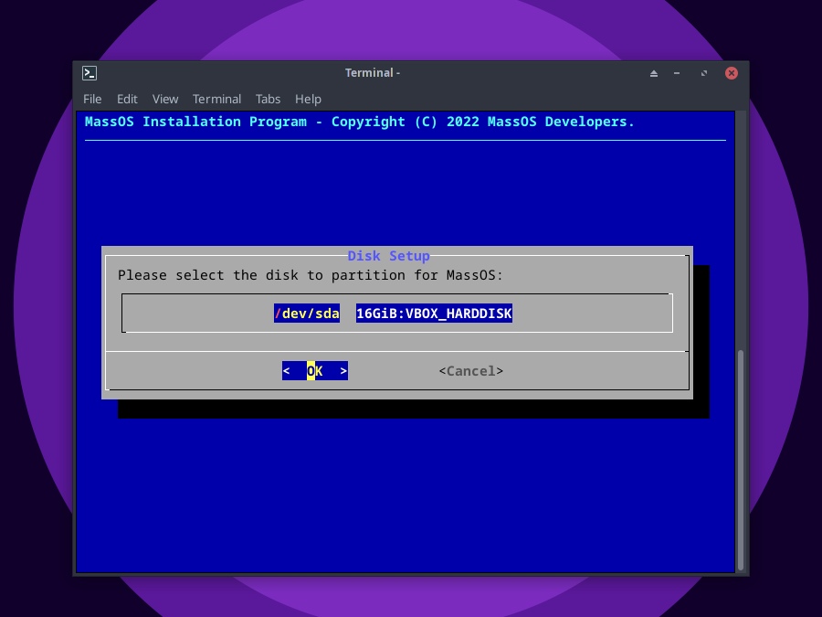
4. Choose how you want to set up the disk. Option 1 will erase the whole disk and install MassOS. Option 2 will let you choose a partition to install MassOS on (for dual-booting). Option 3 will let you manually create and modify partitions.
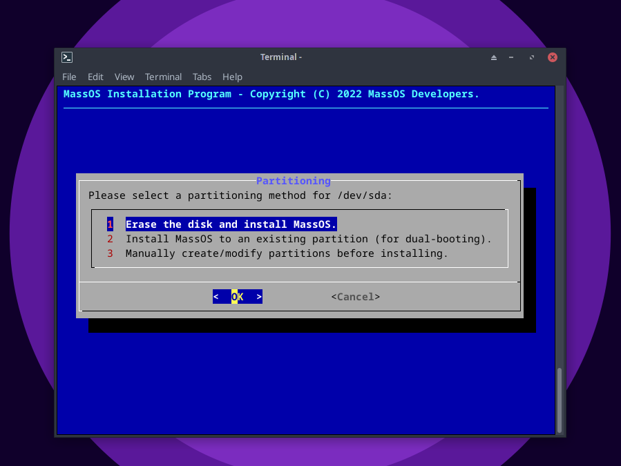
5. If you selected option 2, select the partition you want to use for the root filesystem where MassOS will be installed.
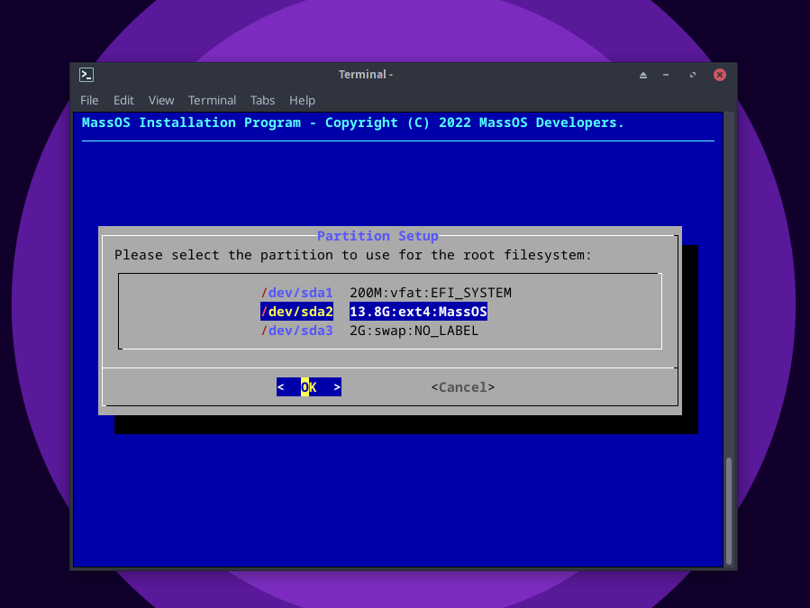
6. Choose the filesystem you want to use for the root partition. If unsure, ext4 is recommended.
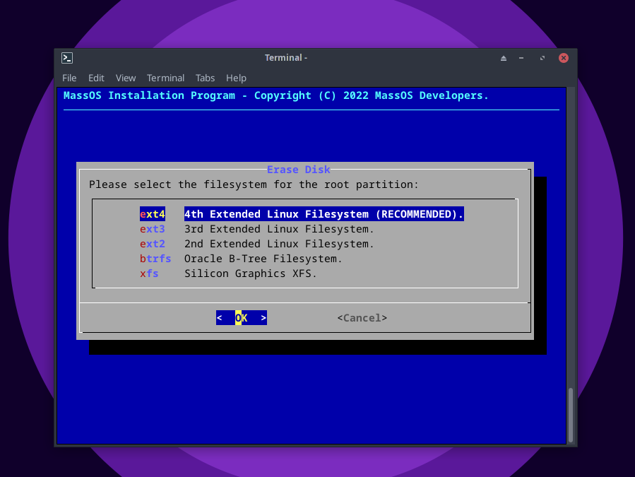
7. Decide whether you want to add a swap partition or not. Swap acts as an emergency RAM backup on the disk in case the system RAM gets full. It is designed to be used in emergency situations only and is not a RAM substitute. If you have less than 8 gigabytes of RAM, swap is advisable.
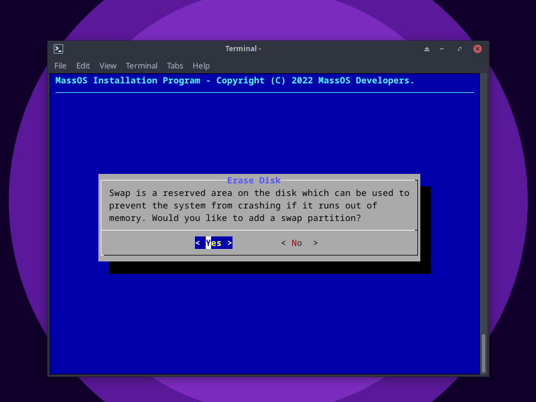
8. After setting up the disk, the installation will begin. This may take a few minutes to complete, so be patient.
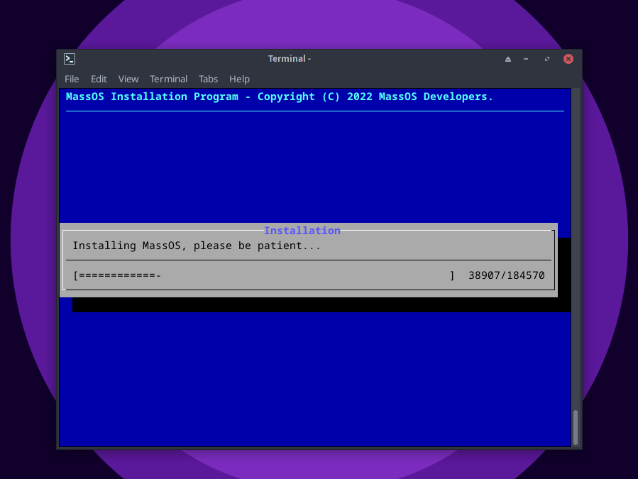
9. After the installation completes, some initial setup will take place. This includes setting up the language, keyboard layout, timezone and user accounts. Follow the instructions given by the installer until the installation is complete.
10. After completing the installation, this message will be shown and then the system will reboot.
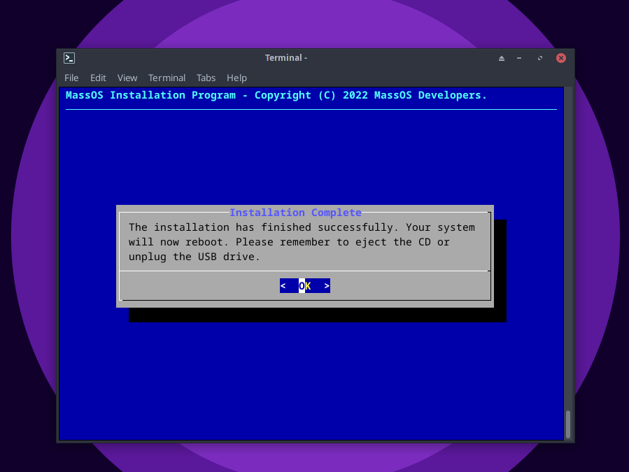
Remember to unplug the USB flash drive to ensure you boot into your new system instead of restarting the live environment.
## What next?
For general information on how to make the most out of your new installation, check out the [Post-installation guide](https://github.com/TheSonicMaster/MassOS/blob/main/postinst.md). It contains information on how to do things like install software, customise your desktop, amongst other useful tips.
