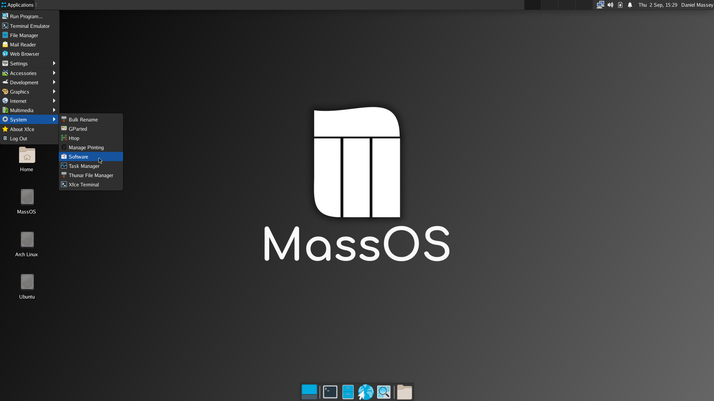
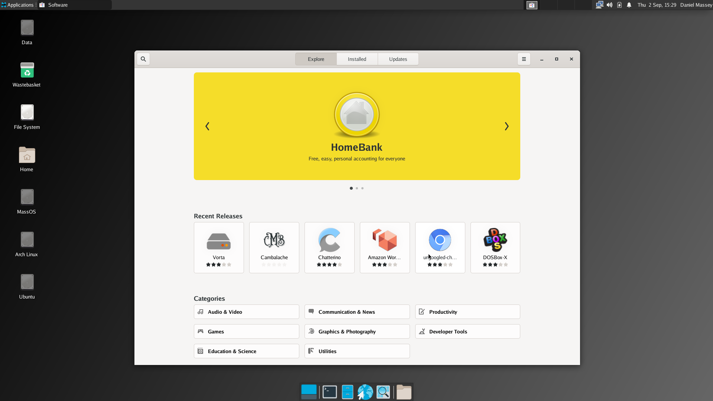
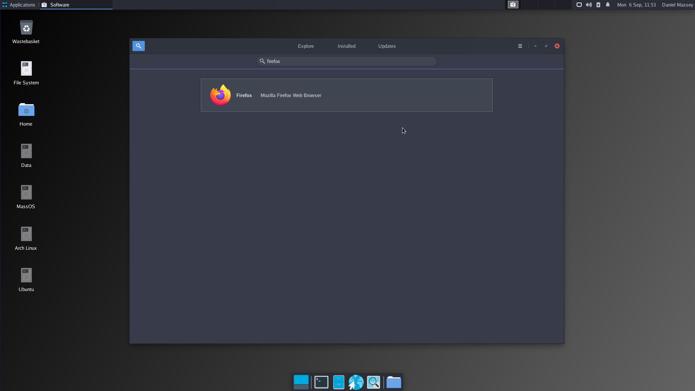
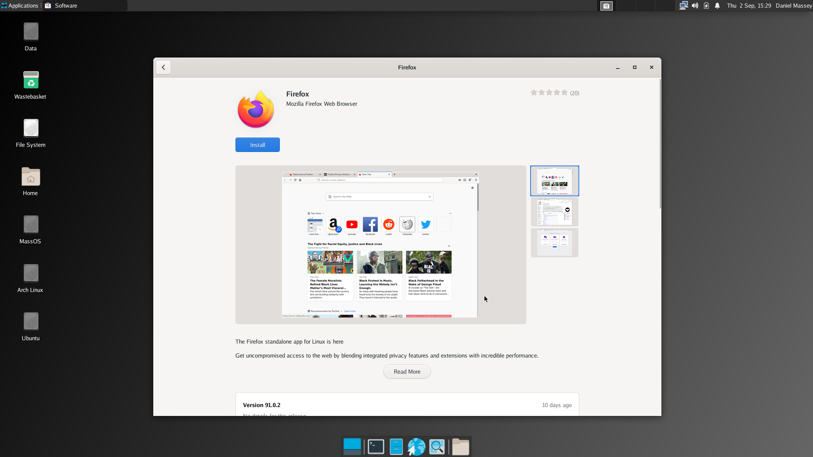
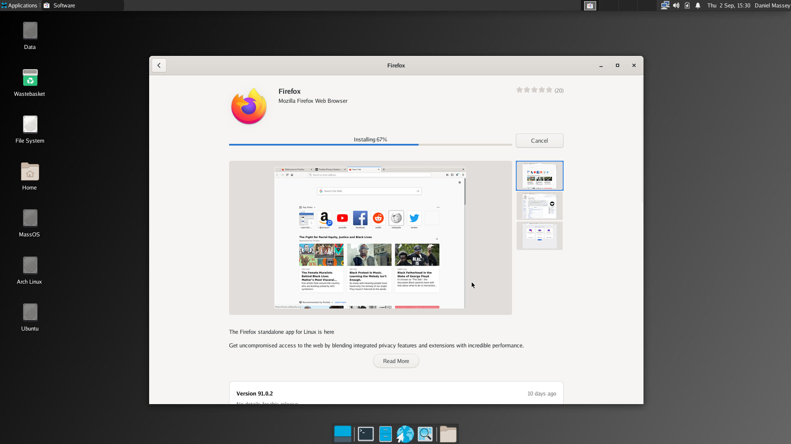

# MassOS post-installation tips
This document contains some useful tips and information for things like installing software, customisation, and other useful tips to make the most out of your MassOS installation.
# Installing software
MassOS has the Flatpak package manager built in. Flatpak provides a nice way of distributing and installing graphical software across many GNU/Linux distributions.

There are two ways you can install Flatpak apps on MassOS. You can either do so from the GUI software center, or from the terminal.
## Installing Flatpak software from the GUI software center
The software center on MassOS is called "Software". You can launch it from the apps menu like this:

The front page of the store contains some recommended aopps. You can browse through the categories, or click the search button at the top left hand corner.

For example: To install Firefox, we will search for "firefox", and select the corresponding result that appears.

Then click "Install" and wait patiently.

When the app is installed, it will be in your apps list. You can also launch it by clicking the "Launch" button in the software center. **NOTE: If it doesn't show up immediately, you may need to restart your desktop session (i.e. logging out and logging back in).**

## Installing Flatpak software from the command-line
Press Control+Alt+T to open the terminal, or find the terminal in your apps list.

You can type the following command to install Flatpak software:
```
flatpak install <name of package>
```
For example, to install Firefox:
```
flatpak install org.mozilla.firefox
```
To search for software, replace `install` with `search`:
```
flatpak search <search term>
```
To list installed software:
```
flatpak list
```
## Suggested software
MassOS is designed to be minimal. It does not include a default web browser or mail client. It's easy to install one using the steps below. Here are some recommended open-source programs. Do not forget that this list barely scratches the surface of what is available with Flatpak:
### Web browsers
- Firefox
- Chromium
- GNOME Web (Epiphany)
### Mail clients
- Thunderbird
- Evolution
- Geary
### Media players
- VLC Media Player
- Celluloid
### Advanced text editors
- Atom
- Visual Studio Code
# Tips.
- While Flatpak is the default and prefered package manager, many software packages can also be run on MassOS via the use of AppImages.
- Most development tools and headers are preserved in the MassOS system, allowing the user to easily compile any missing command-line software they might need. Autotools, Meson, and CMake build systems are supported.
- Many programs store customisable configuration files in `/etc`. If you know what you're doing, feel free to customise the configuration files here.
- MassOS has an SSH server built in. To enable the SSH server, run `sudo systemctl enable --now sshd`. This will allow remote connections to your MassOS machine over SSH.
- While GRUB is the default and recommended bootloader, it also supports systemd-boot. If you know what you're doing, you can use this extremely minimal boot manager instead of the full GRUB bootloader.
