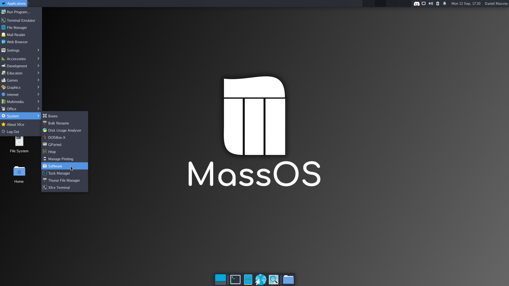
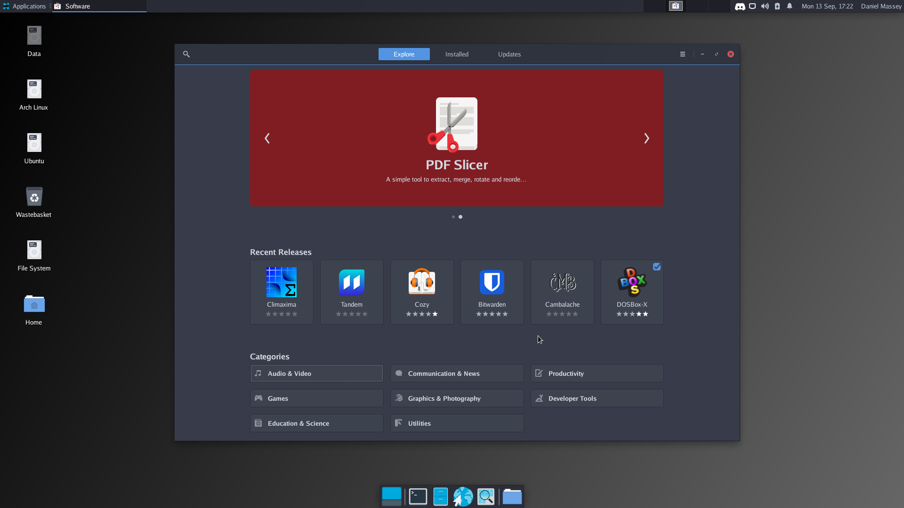
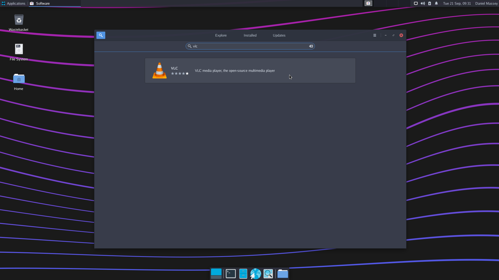
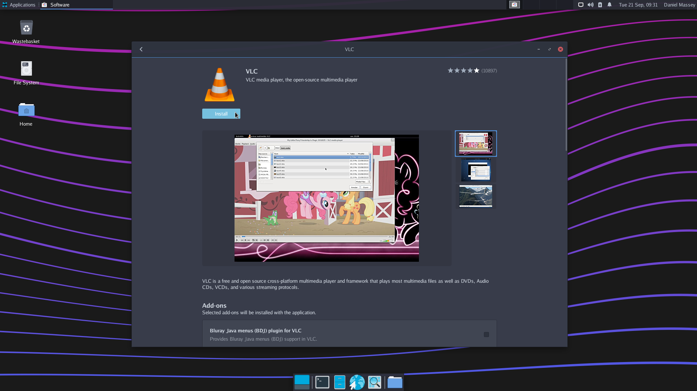

# MassOS post-installation tips
This document contains some useful tips and information for things like installing software, customisation, and other useful tips to make the most out of your MassOS installation.
# Installing software
MassOS has the Flatpak package manager built in. Flatpak provides a nice way of distributing and installing graphical software across many GNU/Linux distributions.

There are two ways you can install Flatpak apps on MassOS. You can either do so from the GUI software center, or from the terminal.
## Installing Flatpak software from the GUI software center
The software center on MassOS is called "Software". You can launch it from the apps menu or search for it with the Xfce appfinder:

Once opened, the front page of the store contains some recommended apps. You can browse through the categories, or click the search button at the top left hand corner:

For example: To install VLC Media Player, we will search for "vlc":

Now click "Install" and wait patiently. When the app is installed, it will be available from your apps list. You can also launch it by clicking the "Launch" button in the software center.

## Installing Flatpak software from the command-line
Press Control+Alt+T to open the terminal, or find the terminal in your apps list.

You can type the following command to install Flatpak software:
```
flatpak install <name of package>
```
For example, to install VLC Media Player:
```
flatpak install org.videolan.VLC
```
To search for software, replace `install` with `search`:
```
flatpak search <search term>
```
To list installed software:
```
flatpak list
```
## Suggested software
MassOS comes preinstalled with the Firefox Web Browser and Thunderbird Mail Client. If you'd prefer to use something else, it's easy to install a different one using the steps below. There are also some other common apps you may want, such as media players and text editors. Here are some recommended open-source programs. Do not forget that this list barely scratches the surface of what is available with Flatpak:
### Alternative web browsers
- LibreWolf
- Chromium
- Midori
- GNOME Web (Epiphany)
### Alternative mail clients
- Evolution
- Geary
- Claws Mail
### Media players
- VLC Media Player
- Celluloid
- Clapper
- mpv
### Advanced text editors
- Atom
- Visual Studio Code
- Brackets
# Upgrading MassOS.
You can use the [MassOS upgrade utility](https://github.com/TheSonicMaster/MassOS) to upgrade an installed version of MassOS.
# Using systemd-boot instead of GRUB.
While GRUB is the default and recommended bootloader, MassOS also supports systemd-boot on UEFI systems. Compared to GRUB, systemd-boot is not a full bootloader, instead it is an extremely small and lightweight "boot manager". It can chainload other EFI applications as well as loading Linux kernels which have EFISTUB enabled (like the kernel in MassOS).

systemd-boot requires the kernel and initramfs to be on the same partition as the EFI system partition. The easiest way to achieve this is by mounting the EFI system partition to `/boot` instead of the standard GRUB-recommended `/boot/efi` location. If desired, change the mountpoint of the EFI system partition to `/boot` in your `/etc/fstab`, and ensure the kernel and initramfs located in `/boot` are placed on the EFI system partition. The rest of this guide assumes the EFI system partition is mounted to `/boot`.

Install systemd-boot to the EFI system partition, and create a bootorder entry named "Linux Boot Manager", by running the following command:
```
bootctl install --esp-path=/boot
```
Unlike GRUB, the configuration file cannot be generated automatically. You must manually create and/or edit the following files.

Create/modify `/boot/loader/loader.conf`, and add the following contents:
```
default massos.conf
timeout 3
console-mode keep
editor no
```
Create/modify `/boot/loader/entries/massos.conf`, and add the following contents:
```
title MassOS
linux /vmlinuz-<kernel-version>
initrd /initrd.img-<kernel-version>
options root="UUID=<root-filesystem-UUID>" ro quiet
```
REMEMBER TO REPLACE `<kernel-version>` with the kernel version, e.g. `5.14.12-massos`, and `<root-filesystem-UUID>` with the full UUID of the root filesystem as defined in `/etc/fstab`.

For more information about systemd-boot, the Arch Wiki has very detailed documentation available at https://wiki.archlinux.org/title/systemd-boot.
# Other tips
- While Flatpak is the default and prefered package manager, many software packages can also be run on MassOS via the use of AppImages.
- Most development tools and headers are preserved in the MassOS system, allowing the user to easily compile any missing command-line software they might need. Autotools, Meson, and CMake build systems are supported.
- Many programs store customisable configuration files in `/etc`. If you know what you're doing, feel free to customise the configuration files here.
- MassOS has an SSH server built in. To enable the SSH server, run `sudo systemctl enable --now sshd`. This will allow remote connections to your MassOS machine over SSH.
